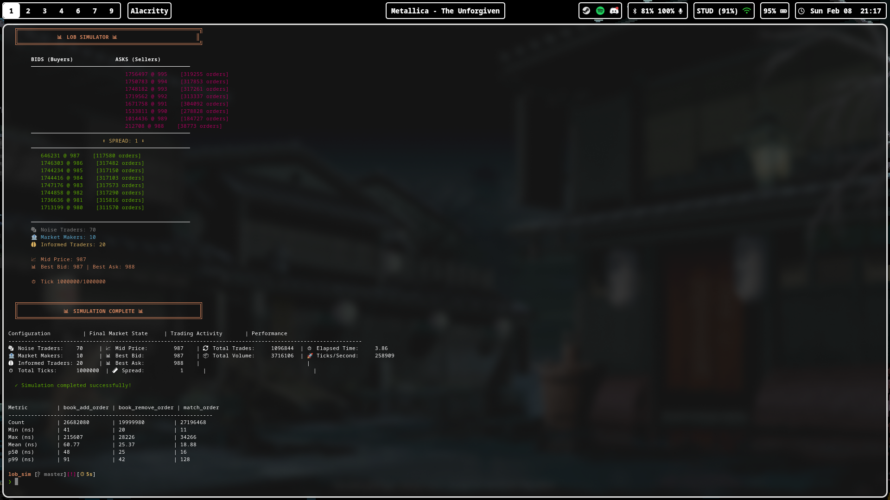

# LOB Simulator

A high-performance **Limit Order Book Simulator** written in C, designed for simulating market microstructure dynamics with heterogeneous trading agents.

---

# DEMO



## Overview

This project implements a complete limit order book matching engine with agent-based market simulation. It models the core infrastructure found in modern electronic exchanges, featuring price-time priority matching, efficient order management, and multiple trader archetypes.

```
┌─────────────────────────────────────────────────────────────┐
│                    LOB SIMULATOR                            │
├─────────────────────────────────────────────────────────────┤
│                                                             │
│   ASKS (Sellers)           │   Agents                       │
│   ─────────────────        │   ──────────────────           │
│   8768 @ 1000 [1607]       │   🎲 Noise Traders             │
│   8980 @ 999  [1620]       │   🏦 Market Makers             │
│   8802 @ 998  [1608]       │   🧠 Informed Traders          │
│      ⬆ SPREAD X ⬇         │                                │
│   8376 @ 991  [1536]       │   Statistics                   │
│   8787 @ 990  [1614]       │   ──────────────────           │
│   8423 @ 989  [1557]       │   📊 Trades: 4,872             │
│   BIDS (Buyers)            │   📦 Volume: 16,371            │
│                                                             │
└─────────────────────────────────────────────────────────────┘
```

---

## Features

### Core Engine
- **Price-Time Priority Matching**: FIFO execution at each price level
- **Red-Black Tree Price Levels**: O(log n) best bid/ask lookup
- **Hash Map Order Index**: O(1) order lookup by ID for fast cancellations
- **O(1) Order Removal**: Doubly-linked level queues with direct node indexing

### Trading Agents
- **Noise Traders**: Random order flow with configurable parameters
- **Market Makers**: Two-sided quotes with inventory management and order cancellation
- **Informed Traders**: Trade on fair value deviations with configurable thresholds

### Simulation Framework
- **Time-stepped simulation** with configurable tick rate
- **Real-time terminal visualization** with ANSI colors
- **Statistics tracking**: trades, volume, prices
- **CLI interface** with command-line options

### Benchmarking
- **Compile-time benchmarking** with `-DBENCHMARK` flag
- **Nanosecond-precision latency tracking** using `clock_gettime(CLOCK_MONOTONIC)`
- **Percentile stats**: p50, p99, min, max, mean
- **Zero overhead** in production builds

---

## Architecture

```
src/
├── core/                   # Order book engine
│   ├── book.c              # Order book management
│   ├── matching.c          # Price-time priority matching
│   ├── price_tree.c        # Red-black tree for price levels
│   ├── level_ops.c         # Price level queue operations
│   ├── order_map.c         # Hash map for O(1) order lookup
│   ├── order.c             # Order creation/management
│   └── trade.c             # Trade record handling
│
├── agents/                 # Trading agents
│   ├── noise_trader.c      # Random order submission
│   ├── market_maker.c      # Two-sided quoting
│   └── informed_trader.c   # Fair value trading
│
├── sim/                    # Simulation framework
│   ├── simulator.c         # Main simulation loop
│   ├── clock.c             # Simulation time management
│   ├── stats.c             # Statistics collection
│   └── event.c             # Event queue (extensible)
│
├── bench/                  # Benchmarking
│   └── latency.c           # Nanosecond latency tracking
│
└── main.c                  # CLI entry point
```

---

## Usage

### Build

```bash
make clean && make
```

Or with optimizations:

```bash
gcc -std=c11 -O3 -Wall -Wextra -Iinclude -o bin/lob_sim \
    src/main.c src/agents/*.c src/core/*.c src/sim/*.c
```

With benchmarking enabled:

```bash
gcc -std=c11 -O3 -Wall -Wextra -DBENCHMARK -Iinclude -o bin/lob_sim_bench \
    src/main.c src/agents/*.c src/core/*.c src/sim/*.c src/bench/*.c
```

### Run

```bash
# Default configuration
./bin/lob_sim

# Custom agents
./bin/lob_sim -n 50 -m 5 -i 10

# Fast benchmark mode
./bin/lob_sim -n 100 -m 10 -i 20 -t 100000 -q

# Show help
./bin/lob_sim -h
```

### Options

| Flag | Description | Default |
|------|-------------|---------|
| `-n, --noise` | Number of noise traders | 5 |
| `-m, --mm` | Number of market makers | 2 |
| `-i, --informed` | Number of informed traders | 2 |
| `-t, --ticks` | Total simulation ticks | 5000 |
| `-q, --quiet` | Quiet mode (benchmark) | false |
| `-h, --help` | Show help | - |

---

## Performance


Measured on an **Intel i7-13620H** (13th Gen, 4.90 GHz) with `-O3` optimization.

### Deep Book Stress Test (1M ticks, 100 agents)

| Operation         | p50   | p99   | Mean   | Max      |
|-------------------|-------|-------|--------|----------|
| `book_add_order`  | 49ns  | 93ns  | 61ns   | 307,190ns |
| `book_remove_order` | 24ns | 40ns  | 25ns   | 28,735ns |
| `match_order`     | 16ns  | 131ns | 19ns   | 24,187ns |

| Configuration | Ticks/Second | Orders/Level | Trades | Volume |
|---------------|--------------|--------------|--------|--------|
| 100 agents    | 255,687      | 319,000+     | 1,094,619 | 3,707,152 |

**Scales to 25M+ order ops, 1M ticks, 1M+ trades, and 300k+ orders per price level.**

### Previous Benchmarks

| Operation | p50 | p99 | Mean |
|-----------|-----|-----|------|
| `match_order` | 15 ns | 127 ns | 18 ns |
| `book_add_order` | 48 ns | 95 ns | 61 ns |
| `book_remove_order` | 25 ns | 41 ns | 25 ns |

| Configuration | Ticks/Second |
|---------------|--------------|
| 100 agents (70N + 10MM + 20I) | **258,347** |
| 9 agents (5N + 2MM + 2I) | **72,781** |

### Optimization Highlight

Order removal was optimized from **O(n) → O(1)** using doubly-linked lists
and direct node indexing in the hash map:

| Metric | Before | After | Improvement |
|--------|--------|-------|-------------|
| `remove` p50 | 235,089 ns | 25 ns | **9,400x** |
| `remove` p99 | 411,925 ns | 41 ns | **10,000x** |
| Throughput | 471 ticks/s | 258,347 ticks/s | **548x** |

Build with `-DBENCHMARK` flag to enable latency tracking.

---

## Data Structures

### Price Tree (Red-Black Tree)
- **Purpose**: Maintain sorted price levels for O(log n) best bid/ask
- **Operations**: Insert, delete, find, min/max
- **Complexity**: O(log n) for all operations

### Order Map (Hash Table)
- **Purpose**: O(1) order lookup by ID for cancellations
- **Implementation**: Open addressing with linear probing
- **Load factor**: Resizes at 75% capacity

### Price Level (Doubly-Linked List)
- **Purpose**: FIFO queue of orders at each price
- **Operations**: Push (back), pop (front), remove by node pointer
- **Complexity**: O(1) push/pop/remove

---

## Future Enhancements

### Performance Optimizations

| Optimization | Expected Impact | Complexity |
|--------------|-----------------|------------|
| **Memory pooling** | 2-3x faster order allocation | Medium |
| **Lock-free structures** | Enable multi-threading | High |
| **SIMD matching** | Batch order processing | High |
| **Cache-aligned structs** | Reduce cache misses | Low |
| **Arena allocator** | Eliminate fragmentation | Medium |

### Feature Additions

| Feature | Description | Value |
|---------|-------------|-------|
| **FIX protocol parser** | Parse real market data | Production-ready |
| **WebSocket feed** | Real-time data streaming | Visualization |
| **Latency histograms** | Measure tick-to-trade latency | Benchmarking |
| **Order flow imbalance** | Buy/sell pressure metrics | Analytics |
| **Volatility estimation** | Rolling price volatility | Risk metrics |
| **Multi-asset support** | Multiple order books | Realistic |
| **Cross-asset arbitrage** | Arbitrageur agents | Strategy |
| **Replay from file** | Replay historical orders | Backtesting |

### Agent Improvements

| Agent Type | Enhancement |
|------------|-------------|
| **Market Maker** | Adaptive spread based on volatility |
| **Market Maker** | Inventory skewing (Avellaneda-Stoikov) |
| **Informed Trader** | Ornstein-Uhlenbeck fair value process |
| **New: Momentum** | Trade with price trends |
| **New: Mean Reversion** | Fade extreme moves |
| **New: HFT** | Latency-sensitive strategies |

---

## Technical Deep Dive

### Matching Engine

The matching engine implements **price-time priority**:

1. Incoming order checked against opposite side
2. Best price matched first (highest bid, lowest ask)
3. At same price, earliest order matched first (FIFO)
4. Partial fills supported
5. Unmatched quantity rests in book

```c
// Pseudocode
while (incoming.qty > 0 && can_match(incoming, best_opposite)) {
    fill = min(incoming.qty, best_opposite.qty);
    execute_trade(incoming, best_opposite, fill);
    
    if (best_opposite.qty == 0)
        remove_from_book(best_opposite);
    
    best_opposite = get_next_best();
}

if (incoming.qty > 0)
    add_to_book(incoming);
```

### Market Maker Strategy

Market makers provide liquidity by quoting both sides:

1. Cancel previous orders (avoid stale quotes)
2. Calculate mid-price from current book
3. Post bid at `mid - half_spread`
4. Post ask at `mid + half_spread`
5. Track inventory exposure

### Informed Trader Strategy

Informed traders have private information about fair value:

1. Maintain internal fair value estimate
2. Apply random drift to fair value (simulate information flow)
3. If `best_ask < fair_value - threshold`: BUY aggressively
4. If `best_bid > fair_value + threshold`: SELL aggressively
5. Trade probability limits order frequency

---

## References

- Harris, L. (2003). *Trading and Exchanges: Market Microstructure for Practitioners*
- Cont, R., Stoikov, S., & Talreja, R. (2010). *A Stochastic Model for Order Book Dynamics*
- Avellaneda, M., & Stoikov, S. (2008). *High-frequency trading in a limit order book*

---

## License

MIT License

---

## Author

Built as a learning project for understanding market microstructure and low-latency systems.
